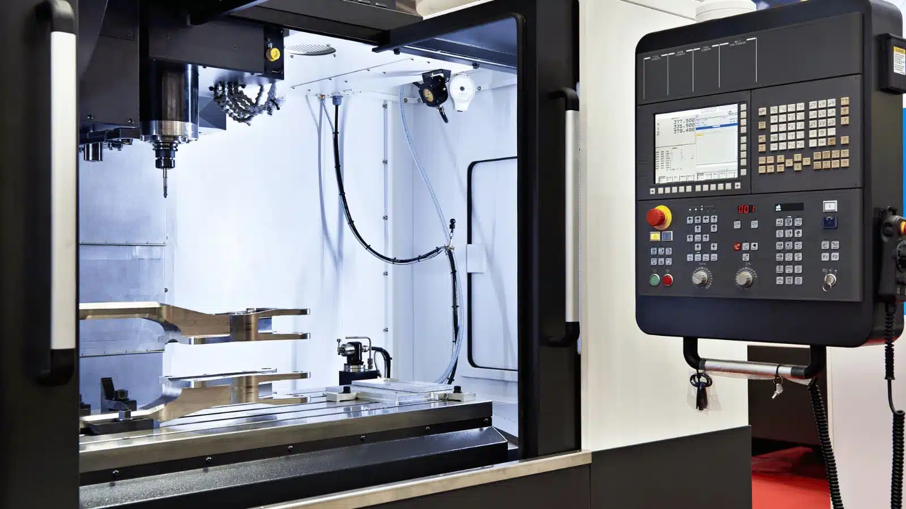

## CNC Operator
### Learning & development
Welcome! This document is a complete list fo all module for taking training for CNC Operator. 

Along with an overview of the module, along with technical information, useful resources, and links to videos can be found under each modules. 
Students should be able to go though each module to get full details about this training.

Modules

Know the basics.

  - **Machine Maintenance**

    - Link to CNC Milling Machine Maintenance Video.
         - [CNC Milling machine maintenance](https://drive.google.com/file/d/1KnSflr7EfE2tNX1U7pp6vTA1TwjFUWbg/view?usp=drive_link)

   - **CNC machine maintenance checklists**

Maintenance checklists help technicians and operators perform their tasks safely and efficiently.

The following sections cover the maintenance tasks that should be performed at different times (daily to annually). These checklists assume that CNC machines undergo eight hours of operations every day, with sufficient breaks. 

You need to adjust the time period of your maintenance in accordance with usage hours, after consulting with machine OEM guidelines. Use the following checklists as a starting point to create a preventive maintenance plan that takes into account the needs and requirements of your manufacturing operation.

  - **Daily maintenance checklist**

    - The following tasks have to be done every day, assuming regular usage hours:
        - Inspect the pressure and level of lubricant. Top up if required.
        - Check coolant level. Use a coolant refractometer to ensure coolant and oil ratio is maintained.
        - Clean out the coolant disposal tray.
        - Check for moisture in pneumatic air. Drain moisture if it is detected.
        - Check pressure of pneumatic air with the pneumatic pressure gauge.
        - Wipe the complete machine with a clean rag.
        - Check the output of the voltage stabilizer. Ensure it adheres to the required specifications.
        - Check panel cooler temperature.
        - Observe noises, bangs, or any other anomalies in machine operation.
        - Watch out for for any overheating signs during machine operation.
          
  - **Weekly maintenance checklists**
   
    - The following maintenance tasks have to be done on a weekly basis:
        - Clean the complete machine shop, especially the area surrounding the machine.
        - Check for any evidence of lubricant, oil, or coolant leakage. 
        - Check and ensure all cooling fans are working properly. These include spindle motor fans, cooling system fans, and hydraulic motor fans.
        - Perform visual inspection of machine components. Apply grease or appropriate lubricant to parts that seem dry.
        - Check whether tool heads are held securely in the tool changer.
        - Lubricate v-groove, plungers, slider cap, extractor forks, keys, and springs of the tool changer.
        - Check if all electrical components such as switches and lights are working properly.

  - **Monthly maintenance checklists**

    - Maintenance checks that should be done every month include the following:
        - Clean out the chip collector close to the coolant tank.
        - Inspect, remove, and adjust jaws, chucks, and fixtures.
        - Clean or replace air filters as required.
        - Check the condition of tool heads and change them if necessary.
        - Inspect, lubricate, tighten, and adjust chains and conveyors in the machine.
        - Clean various fans of the machine to prevent dust accumulations.
        - Inspect the logs of oil, lubricant, and coolant. Check for any anomalous consumption.
        - Clean radiator grills of dust and debris.   

  - **Annual maintenance checklists**

    - CNC machine maintenance checks that need to be done annually:
        - Remove coolant cylinder tank for inspection.
        - Clean out the coolant cylinder for debris, inspect for bacteria or fungal growth, and clean the tank.
        - Drain used lubricant, clean lubricant housing, and refill it.
        - Inspect for presence of contaminants in pneumatic oil. Change it if required.
        - Replace all oil filters.
        - Run software simulations to check the alignment and indentation of tools.
        - Use software to quickly reverse the axis of the toolhead to check for backlash. If the toolhead experiences a backlash effect, further maintenance is required.   

  

Understanding Process.

Tooling.

- **Speeds & Feeds**

    - Link to Video to understand calculation of Speed & Feed in machining
         - [Speeds & Feeds Part 1](https://drive.google.com/file/d/1gvR8f9bnPZjLrWY_Jv1H3pN0ed1RpbqP/view?usp=drive_link)
         - [Speeds & Feeds Part 2](https://drive.google.com/file/d/1DsCkQOSpyemhlnEyhX_-QOer0hD4TfbI/view?usp=drive_link)

- **A Comprehensive Guide to CNC Milling Tools and Their Uses**

Ever wondered how intricate parts and components are crafted with precision in the manufacturing world? The secret lies in the power of CNC milling tools. These high-tech cutting tools create a vast array of shapes, slots, and holes, enabling manufacturers to bring their designs to life. As you embark on this captivating journey to explore the world of CNC milling tools, you’ll discover the different types of cutting tools, their materials, and coatings, and the factors to consider when choosing the best tool for your project.

Unleash your creativity and empower your projects with the knowledge of CNC milling tools, their applications, and how to select the right tool for every job. From end mills to specialty tools, dive into a world where technology and craftsmanship collide to produce impeccable results. Let’s begin!

- **Short Summary**

    - Understanding the different types of CNC milling tools and their functions is essential for a successful machining operation.
    - Tool selection should be based on factors such as workpiece material, machining operation, and tool geometry to ensure optimal performance and precision.
    - Tool coatings can also improve properties of CNC milling tools while maximizing their performance.
      
- **Understanding CNC Milling Tools**

CNC milling tools are the key players in the world of machining operations. These cutting tools, employed in the milling process, remove material from fixed workpieces in a rotary motion. With a multitude of cutting tools available, CNC machines offer a virtually limitless range of possibilities. Familiarizing oneself with the functions of these tools is crucial before engaging with any CNC milling machine tools or shop.

Among the vast array of CNC milling cutters, four main types stand out: end mills, twist drills, face mills, and ball nose mills. Each type serves a unique purpose and offers specific advantages to help you achieve the desired results in your projects. Let’s delve deeper into these three categories.

- **End Mills**

End mills are the Swiss army knives of CNC milling tools. These versatile cutting tools are capable of creating holes, slots, and profiles on workpieces with diverse flutes and noses. They come in various types such as bull nose end mills, roughing end mills, V-bit end mills, and flat end mills (also called Square End Mills). The horizontal cutting edges on the side of an end mill are referred to as flutes, and their number influences the feed rate and cutting speed.

When selecting end mills, it’s essential to consider the workpiece material, machining operation, and tool geometry. With the right end mill, you can achieve the perfect balance of performance and precision, ensuring the success of your project.

- **Twist Drills**

Twist drills are the most popular tools for making holes.

- **Face Mills**

Face mills are the go-to tools for creating flat surfaces on raw materials. These milling cutters have a single body with replaceable cutting inserts, ensuring optimal quality and a longer lifespan. Face mills are often compared to fly cutters, which are less expensive and can be fabricated in-house. However, face mills provide better precision and are more suitable for high-quality cutting.  Fly cutters, OTOH, can provide a nicer surface finish than most face mills.

The choice between face mills and fly cutters depends on your specific needs, budget, and desired level of precision. Both tools have their pros and cons, but when it comes to creating flat surfaces with high precision, face mills and fly cutter can rise to the challenge.

- **Ball Nose Mills**

Ball nose mills are the artists among CNC milling tools. Featuring a hemispherical end, they specialize in creating intricate shapes, slots, and pockets in a workpiece. These milling cutters excel in creating corner radiuses on perpendicular faces, allowing for smooth transitions and even contours to mill flat surfaces.

The benefits of employing ball nose mills are numerous, including their ability to access tight spaces and corners, as well as generating a finer finish than other milling cutters. When precision and smoothness are paramount, ball nose mills are the ideal choice.

- **Speciality CNC Milling Tools**

Every artist has a set of specialty tools for unique applications, and CNC milling is no exception. Specialty CNC milling tools are designed for specific purposes, catering to projects that require a touch of finesse or a unique approach. These tools are employed in CNC milling machines to selectively remove material from a block of raw substrate, ensuring the highest level of precision and accuracy.

Examples of specialty CNC milling tools include gear cutters, thread mills, and slitting saws. Let’s take a closer look at some of these specialty milling tools and their applications.

- **Gear Cutters**

Gear cutters are the engineers of the CNC milling world, responsible for milling cutter fabricating gears that keep the wheels of industry turning. These specialty tools require a hobbing machine, and the type of hobbing machine depends on the number of gear teeth.

From automotive transmissions to heavy machinery, gears play a crucial role in various applications. Gear cutters ensure that these integral components are crafted to perfection, using the right type of hobbing machine for the job.

- **Thread Mills**

Thread mills are the masters of cutting process of creating internal threads in workpieces. These specialty tools come in three types: roll form taps, cut taps, and thread mills. These types are employed on numerically controlled machining centers that are equipped with simultaneous, triaxial control, and helical interpolation features.

Whether you’re creating tapped holes or cutting internal threads, thread mills offer precision and accuracy to achieve the perfect result. With the right thread mill, you can ensure that your components fit together seamlessly, providing a secure connection.

- **Material Selection for CNC Milling Tools**

Just as an artist chooses the right canvas for their masterpiece, selecting the right material for CNC milling tools is crucial for achieving optimal results. The choice of material depends on the desired hardness and duration of use. Common materials used for CNC cutting tools include carbon steel, high-speed steel, and carbide.

Each material has its benefits and drawbacks, with the ideal choice depending on factors such as workpiece material, machining operation, and tool geometry. Let’s explore these materials in more detail, and uncover their unique properties.

- **Carbon Steel**

Carbon steel is the most economical material used for milling cutters, suitable for low-speed operations. This material is often found in various tools such as milling cutters and twist drills. However, carbon steel is not suitable for high-speed operations or cutting hard materials due to its limited durability and low melting point.

While carbon steel is an inexpensive option, it is important to consider its limitations. For projects requiring higher speed or toughness, other materials such as high-speed steel or carbide may be more suitable.

- **High-Speed Steel (HSS)**

High-speed steel (HSS) is a game-changer in the world of milling cutters. HSS is made up of chromium, tungsten, and molybdenum. It offers greater hardness, toughness, and durability compared to conventional carbon steel. This material is suitable for cutting both ferrous and nonferrous metals, with a higher resistance to heat and wear.

Due to its enhanced properties, high-speed steel is ideal for milling tools required to operate at higher speeds and cut harder materials. With HSS, you can ensure longer tool life and greater efficiency in your machining operations.

- **Carbide**

Carbide, more properly known as Tungsten Carbide, is the heavyweight champion of CNC milling tool materials. This highly resistant material is ideal for high-quality surface finishes in newer milling machines. Carbide is a combination of carbon and tungsten, forming a chemical compound that offers superior resistance to wear compared to HSS.

If you’re looking for a milling tool material that can withstand the toughest of projects, carbide is the way to go. Its resistance to wear, coupled with its ability to produce high-quality finishes, makes it a popular choice among CNC milling professionals.

- **Tool Coatings for Enhanced Performance**

A masterpiece requires not only the right canvas, but also the right paint. Tool coatings play a vital role in enhancing the performance and durability of CNC milling tools. By improving the properties of the tools and helping them withstand high temperatures, coatings such as titanium nitride (TiN), titanium carbo nitride (TiCN), aluminum titanium nitride (AlTiN), and diamond-like carbon pave the way for flawless machining operations.

Let’s take a closer look at these common coatings, and discover how they can elevate the performance of your milling cutters.

- **Titanium Nitride (TiN)**

Titanium nitride (TiN) is a popular coating used to increase the hardness and thermal stability of cutting tools. This golden coating was once the go-to choice for milling tools, but its use has waned with the introduction of newer coatings that offer better properties.

While titanium nitride may not be the most cutting-edge tool coating available today, it still plays a role in enhancing tool performance. In particular, TiN coatings can extend tool life, reduce adherence to workpieces, and improve hardness.

- **Chromium Nitride**

Chromium nitride is an underdog in the world of tool coatings. This hard, inert, thin film coating enhances hardness, corrosion resistance, and thermal strength for high heat applications. However, chromium nitride coatings can be costly and require specialized equipment for application.

Despite its drawbacks, chromium nitride offers significant benefits for certain machining tools and operations. If your project demands a tool with high heat resistance and corrosion protection, chromium nitride may be the perfect coating for the job.

- **Aluminium Titanium Nitride (AITiN)**

Aluminum titanium nitride (AlTiN) is a rising star in the realm of machine tool coatings. Composed of 65% aluminum, AlTiN enhances the heat resistance of CNC machine tools, making it an ideal choice for high-temperature operations. This coating offers increased heat resistance, enhanced wear resistance, and improved oxidation resistance compared to other coatings.

With its unique combination of properties, AlTiN is a valuable addition to any CNC milling tool arsenal. Equip your tools with this powerful coating, and watch your machining operations reach new heights of performance.
  
- **Factors to consider when choosing CNC milling tools**

Selecting the right CNC milling tool for your project is both an art and a science. To ensure successful surface roughness machining, it’s important to consider factors such as workpiece material, machining operation, and tool geometry. By taking these factors into account, you can choose the ideal tool for your specific needs and unlock the full potential of your CNC milling operations.

Let’s explore each of these factors in more detail, and gain a deeper understanding of how they influence the selection of CNC machine tools.

- **Workpiece Material**

The first factor to consider when selecting a CNC milling tool is the workpiece material. The tool you choose must be harder than the material it’s cutting in order to be effective. For example, carbon steel tools are suitable for cutting lightweight materials like foam and plastic, while high-speed steel or carbide tools are better suited for cutting harder materials like cast iron or superalloys.

By considering the toughness of other tools in the workpiece material, you can ensure that your chosen tool has the necessary hardness to achieve the desired results.

- **Machining Operation**

The machining operation is another crucial factor to consider when selecting the right CNC milling tool. Different cnc machining tools have specific properties, such as tool life and the ability to cut hard materials like cast iron. By evaluating the requirements of the machining operation, you can choose a tool that has the right balance of performance and durability.

With the right tool in hand, you can optimize your machining operations for maximum efficiency and achieve the best possible results for your project.

- **Tool Geometry**

Lastly, tool geometry plays a vital role in the selection of CNC milling tools. The number of flutes on a tool, for example, determines the feed rate and velocity of the machining operation. However, too many flutes can cause cut-off bits to get stuck, leading to suboptimal results.

By understanding the impact of tool geometry on the machining process, you can make informed decisions on the best tool for your specific needs, ensuring a smooth and successful machining operation.

- **Summary**

In conclusion, the world of CNC milling tools is a fascinating and diverse landscape, filled with cutting-edge technology and precision craftsmanship. By understanding the different types of tools, their materials, coatings, and the factors to consider when selecting the right tool for your project, you can unlock the full potential of your own CNC machine tool and milling operations.

Embark on your journey into the realm of CNC milling with confidence, armed with the knowledge and expertise to make informed decisions and achieve impeccable results. The power to create incredible components and bring your designs to life is in your hands. Happy milling!

- **Frequency Asked Questions**
  1. What cutting tools are used on a CNC machine?

     CNC machines use cutting tools such as end mills, drill bits, ball cutters, slitting saws, face mills, involute gear cutters, fly cutters, roughing end mills, and woodruff cutters to create parts with precise dimensions.

     These tools are designed to cut through a variety of materials, including metals, plastics, and wood. They are used in a variety of industries, including automotive, aerospace, and medical device manufacturing. CNC machines are highly precise and can produce parts with tight tolerances. They are also capable of producing complex shapes and intricate details.

  2. What do I need to start CNC milling?

     To begin CNC milling, you’ll need to plan and form your business into a legal entity, register for taxes, open a business bank account and credit card, and set up accounting. By taking the time to ensure that all of these steps are taken, you can make sure that your CNC milling machine and business is off to a strong start.

  4. Which mill is the most commonly used cutting tool in CNC applications?

     The most commonly used cutting tool for CNC applications is the end mill. Its ease of use and versatility make it a great choice for machining operations, providing reliable results every time.

  6. What are the 3 types of milling cutters?

     Milling cutters come in three primary types: the end mill, face mill and twist drill. Additionally, many other cutters are also available for specialized applications.

     With these tools, it is possible to efficiently shape and size metals to a desired specification.

Coding.

- **G & M Code**

    - Link to G & M Code basics Video.
         - [CNC Milling machine Coding](https://drive.google.com/file/d/1oBz52d4kjt5aYJ5fNEcydOtUPrNZSapI/view?usp=drive_link)
  

Setup and machining.

  - **CNC Mill Tutorial** - Below topics are covered in this video tutorial
    - [CNC Milling Turorial](https://drive.google.com/file/d/1NkA_WdPVcbZo8QnTUrKDcC3Ld5iI8tSQ/view?usp=drive_link)
      - Tool Change and Edge finder.
      - Locating Part.
      - Zeroing Part.
      - Tool Change.
      - Machining Part and Running G-Code
      - Clean-up

   - **CNC Mill machining** - Below 2 video covers multisetup part machining training
     - [First Setup](https://drive.google.com/file/d/1yy8SxxroQqPrRxoPESRw4Z45farlKz9v/view?usp=drive_link)
     - [Second Setup](https://drive.google.com/file/d/1eWqnB06XG1MOyC1_OBEUsPOZiFHE1eld/view?usp=drive_link)

